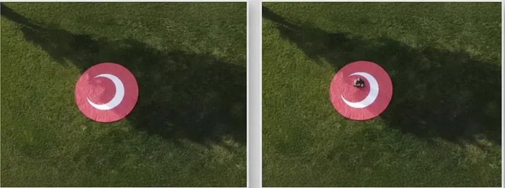
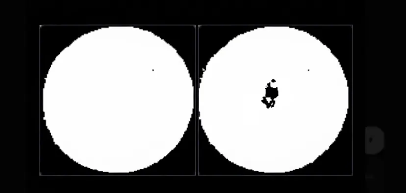

# UAV Landing Area Detection System

A computer vision system that determines safe landing areas for Unmanned Aerial Vehicles (UAVs) by analyzing UAP (Uçan Araba Park - Flying Car Parking) and UAI (Uçan Ambulans İniş - Flying Ambulance Landing) zones.

<p align="center">
  
  
</p>

<p align="center">
  <b>Before</b> 🡒 <b>After</b>
</p>

## 📖 Detailed Article

For a comprehensive explanation of the approach and methodology, read the full article on Medium:

**[Ready to Land: How a UAV Determines a Safe Landing Area Using Computer Vision](https://medium.com/@ibraahimycl/ready-to-land-how-a-uav-determines-a-safe-landing-area-using-computer-vision-2-5a9c1f25f35d)**

## 🎯 Features

- **Dual Detection System**: Supports both UAP and UAI landing zone detection
- **Color Channel Processing**: Different approaches for UAP (grayscale) and UAI (red channel)
- **Intersection Detection**: Checks for objects within landing zones using bounding box analysis
- **Pixel-Level Analysis**: Binary image analysis to detect obstructions
- **Automated Decision Making**: Determines landing suitability based on black pixel threshold

## 🏗️ Project Structure

```
uai/
├── uai_uap_son.py              # Main processing script
├── inputfiles/                  # Sample input images and coordinates
│   ├── *.jpg                    # Test images
│   └── *.txt                    # Coordinate files (YOLO format)
├── results/                     # Processed output images
│   ├── uai_processed*.jpg
│   └── uap_processed*.jpg
└── trialpictures/              # Additional test datasets
    ├── UAI/
    └── UAP/
```

## 🚀 How It Works

### 1. Coordinate Intersection Checking
- Extracts UAP/UAI bounding boxes from coordinate files
- Checks for overlaps with other detected objects
- Determines if the landing area is clear of obstructions

### 2. Color Conversion
- **UAP**: Converts to grayscale for better contrast detection
- **UAI**: Uses red channel extraction for optimal visibility of red landing markers

### 3. Binary Thresholding
- **UAP**: Adaptive threshold (default: 127)
- **UAI**: Fixed threshold (140) for red channel

### 4. Pixel Analysis
- Detects white pixel boundaries (landing pad edges)
- Counts black pixels within boundaries (potential obstacles)
- Calculates obstruction ratio

### 5. Decision Making
- **Landing Suitable**: Black pixels ≤ 100
- **Landing NOT Suitable**: Black pixels > 100

## 📋 Requirements

```bash
pip install numpy opencv-python
```

## 💻 Usage

### Process Single Image

```bash
python uai_uap_son.py
```

Then enter the paths when prompted:
```
Enter image path: inputfiles/04uai.jpg
Enter coordinate file path: inputfiles/04uai.txt
```


## 📊 Input Format

Coordinate files use YOLO format:
```
class_id center_x center_y width height
```

- `class_id`: 0 (UAI) or 1 (UAP)
- Coordinates are normalized (0-1)

Example:
```
0 0.4236979166666667 0.40555555555555556 0.0640625 0.1037037037037037
```

## 🎨 Sample Results

The system outputs:
- Processed binary images showing landing area
- Pixel statistics (white/black counts)
- Landing suitability decision
- Black pixel ratio

Example output:
```
UAI Results (Image Processing):
Image: inputfiles/04uai.jpg
Coordinates: inputfiles/04uai.txt
Total pixels: 5234
Total white pixels: 5180
Total black pixels: 54
Black pixel ratio: 1.03%
Landing area is suitable (black pixels <= 100)
```

## 🔧 Key Functions

### `process_single_image()`
Main processing function that handles the entire pipeline from image loading to decision making.

### `check_coordinate_intersection()`
Detects if UAP/UAI areas intersect with other objects using bounding box logic.

### `analyze_image()`
Performs pixel-level analysis on binary images to count obstructions.

### `is_landing_area_visible()`
Validates landing area dimensions using aspect ratio (0.7 - 1.3).

## 🎓 Technical Approach

1. **Model Detection**: Uses YOLO-format coordinates for object detection
2. **Image Processing Fallback**: When no intersections detected, uses image processing
3. **Aspect Ratio Validation**: Ensures landing area has valid circular/square shape
4. **Column-wise Analysis**: Analyzes each column for top/bottom boundaries
5. **Threshold-based Decision**: Simple, robust threshold for landing suitability

## 📝 Citation

If you use this code in your research or project, please cite:

```
Ibrahim Yucel. "Ready to Land: How a UAV Determines a Safe Landing Area Using Computer Vision"
Medium, 2025. https://medium.com/@ibraahimycl/ready-to-land-how-a-uav-determines-a-safe-landing-area-using-computer-vision-2-5a9c1f25f35d
```

## 🤝 Contributing

Contributions are welcome! Please feel free to submit a Pull Request.

## 📄 License

This project is open source and available under the MIT License.

## 👤 Author

**Ibrahim Yucel**
- Medium: [@ibraahimycl](https://medium.com/@ibraahimycl)

## 👥 Project Team

This project was developed by:

- [İbrahim Yücel](https://github.com/ibraahimycl)
- [Yusuf Doğu](https://github.com/yusufdogu)

## 🙏 Acknowledgments

- Computer vision techniques adapted for UAV landing detection
- YOLO format for object detection coordinates
- OpenCV for image processing capabilities

---

For more details on the methodology and approach, please read the [full article on Medium](https://medium.com/@ibraahimycl/ready-to-land-how-a-uav-determines-a-safe-landing-area-using-computer-vision-2-5a9c1f25f35d).

